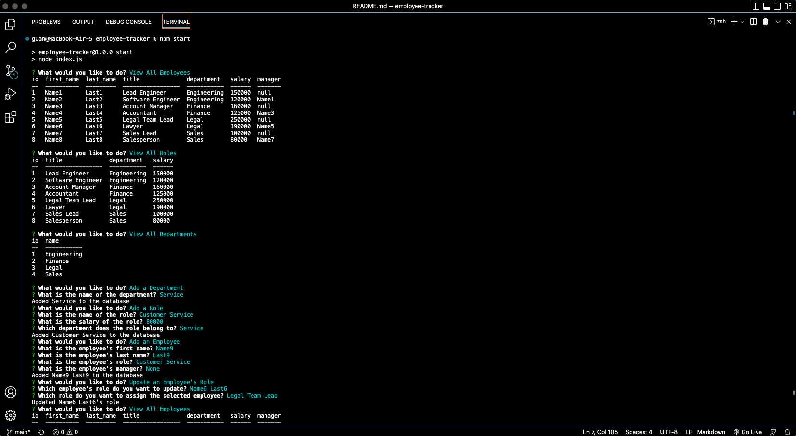

# Employee Tracker

[](https://drive.google.com/file/d/1MxiW2J0EtrRyHvGTarxYyr6yNk6hUIdP/view?usp=sharing)
[Link to Video](https://drive.google.com/file/d/1MxiW2J0EtrRyHvGTarxYyr6yNk6hUIdP/view?usp=sharing)

## Description
The project was built to be able to view and manage the departments, roles, and employees in a company. The user is presented with the options to view all departments, view all roles, view all employees, add a department, add a role, add an employee, and update an employee's role when the application is started. When view all departments, view all roles, or view all employees are selected, the user is presented with a formatted table. When add a department, add a role, add an employee, or update an employee's role are selected, the user is prompted to enter information prompted from the command line.

## Technologies Used
- JavaScript
- Git
- GitHub
- Node.js
- MySQL

## Usage
In the command line run:
```console
npm start
```
When prompted, answer the prompted question to view all departments, view all roles, view all employees, add a department, add a role, add an employee, or update an employee's role.

## License
Please refer to the LICENSE in the repo.

## Author Links
[GitHub](https://github.com/ncguan)